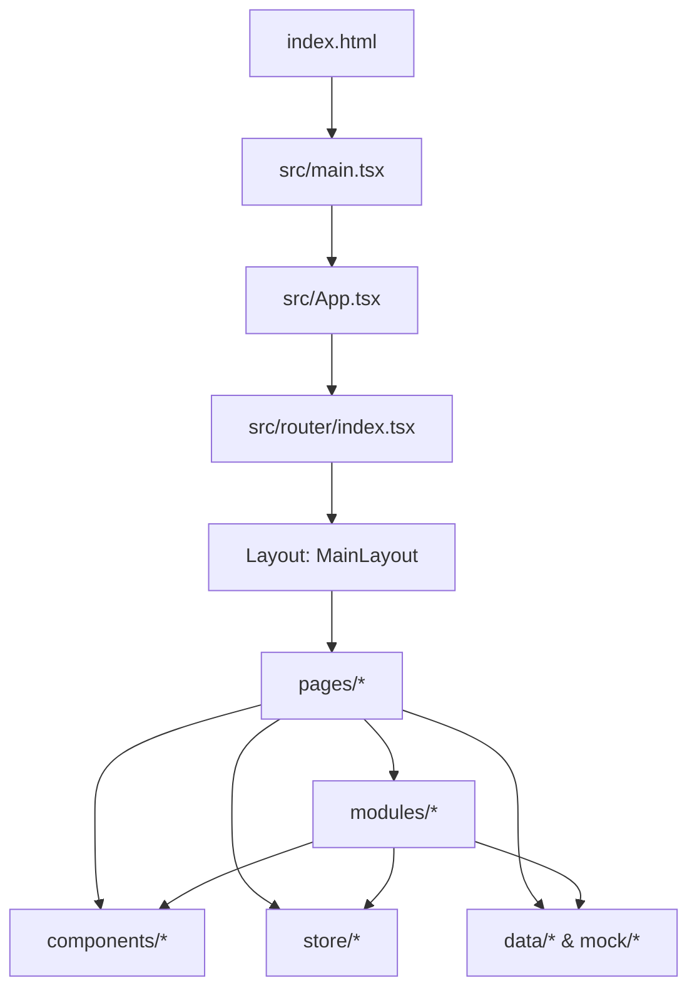

# Code Wiki（weiai-ctms-prd）

本文档面向需要快速理解与二次开发本仓库的工程师，覆盖：整体架构、模块职责、关键类型/函数、依赖关系、运行方式与典型业务链路。

## 1. 项目概览

### 1.1 技术栈

- 构建工具：Vite（见 [package.json](file:///workspace/package.json#L6-L11)、[vite.config.ts](file:///workspace/vite.config.ts#L1-L13)）
- 前端框架：React（见 [package.json](file:///workspace/package.json#L12-L25)）
- 路由：react-router-dom（HashRouter + Routes，见 [main.tsx](file:///workspace/src/main.tsx#L1-L13)、[router/index.tsx](file:///workspace/src/router/index.tsx#L1-L60)）
- 状态管理：Zustand（见 [src/store](file:///workspace/src/store)）
- 样式：Tailwind CSS（见 [tailwind.config.js](file:///workspace/tailwind.config.js#L1-L26)、[postcss.config.js](file:///workspace/postcss.config.js#L1-L6)）
- 交互/可视化：@dnd-kit（模板构建器拖拽）、ApexCharts（图表）

### 1.2 运行入口（从启动到页面）

1. HTML 入口：[index.html](file:///workspace/index.html)
2. React 挂载：[main.tsx](file:///workspace/src/main.tsx#L1-L13)
3. 应用根组件：[App.tsx](file:///workspace/src/App.tsx#L1-L8)
4. 路由树定义：[router/index.tsx](file:///workspace/src/router/index.tsx#L1-L60)
5. Layout 壳组件：[MainLayout.tsx](file:///workspace/src/components/layout/MainLayout.tsx#L1-L21)（Header + Sidebar + Outlet）

### 1.3 目录结构（关键部分）

```text
/
├─ public/                     静态资源（直接被 Vite serve）
├─ docs/                       设计与规范文档（本 Code Wiki 也在此）
├─ src/
│  ├─ components/              通用 UI 与布局组件
│  ├─ pages/                   路由页（屏幕级组合）
│  ├─ modules/                 领域模块（按业务域沉淀的组件/逻辑）
│  ├─ store/                   Zustand 状态
│  ├─ data/                    业务样例数据（含 EDC mock）
│  ├─ mock/                    主站 mock 数据
│  ├─ lib/                     通用工具（classNames/statusMap 等）
│  ├─ types/                   领域类型（Project/Subject/Template/Appointment）
│  ├─ App.tsx
│  └─ main.tsx
├─ index.html
├─ package.json
└─ vite.config.ts
```

## 2. 整体架构

### 2.1 分层与依赖方向

本仓库是单体前端应用（未发现后端工程与 API client 统一封装），多数页面数据来自 `src/mock`、`src/data` 与 `src/store` 的本地状态。

推荐的理解方式（也是当前代码的主要依赖方向）：



- 上层（router/pages）组合下层（modules/components/store/data）
- 下层模块尽量不反向依赖 router/pages（当前大体满足）

### 2.2 子系统划分

从路由与目录看，本项目可拆为三块：

1. 主站（CTMS Web 端通用功能）：`/index/*` 下的 dashboard/projects/users/roles/system 等（见 [router/index.tsx](file:///workspace/src/router/index.tsx#L30-L45)）
2. EDC 子系统：`/index/edc/*` 下的 projects/appointments/templates（见 [router/index.tsx](file:///workspace/src/router/index.tsx#L46-L52)）
3. 小程序聚合页：`/miniprogram`（见 [router/index.tsx](file:///workspace/src/router/index.tsx#L54-L56) 与 [docs/specs/ctms-miniprogram-design-spec.md](file:///workspace/docs/specs/ctms-miniprogram-design-spec.md)）

## 3. 路由与布局

### 3.1 路由表（入口）

- 路由统一入口函数：`AppRoutes()`：[router/index.tsx](file:///workspace/src/router/index.tsx#L27-L59)
- 路由组织方式：
  - `/index` 使用 [MainLayout.tsx](file:///workspace/src/components/layout/MainLayout.tsx#L1-L21) 作为壳
  - EDC 子系统挂载在 `/index/edc/...`
  - `/miniprogram` 也复用 MainLayout
  - `/` 重定向到 `/index`（见 [router/index.tsx](file:///workspace/src/router/index.tsx#L57-L58)）

### 3.2 页面标题/面包屑（Header Store）

页面普遍通过 `useHeaderStore().setTitle(...)` 设置顶栏展示：

- Store 定义：[useHeaderStore.ts](file:///workspace/src/store/useHeaderStore.ts#L1-L15)
- 调用示例：
  - 模板中心页：[TemplateCenterPage.tsx](file:///workspace/src/pages/edc/templates/TemplateCenterPage.tsx#L18-L30)
  - 模板构建器页：[TemplateBuilderPage.tsx](file:///workspace/src/pages/edc/templates/TemplateBuilderPage.tsx#L24-L34)
  - 受试者详情页：[SubjectDetailPage.tsx](file:///workspace/src/pages/edc/projects/SubjectDetailPage.tsx#L13-L37)

## 4. 核心模块详解（重点：EDC）

### 4.1 EDC 表单引擎（form-engine）

位置： [src/modules/edc/form-engine](file:///workspace/src/modules/edc/form-engine)

它解决的问题是：用一套 schema（字段数组）驱动 eCRF 表单渲染与表单值结构生成。

#### 4.1.1 关键类型

- `BuilderFieldType` / `BuilderField`：字段 schema 基本结构（type/label/key/可选配置）
- `DynamicFormValue`：运行时表单值（Record）

定义文件：[types.ts](file:///workspace/src/modules/edc/form-engine/types.ts#L1-L28)

#### 4.1.2 Schema → 初始表单值

- `buildInitialFormData(fields)`：把字段数组转换为 `formData` 的初始结构（包含 eyeGrid/matrix/dynamicList 的特殊初始化）

实现：[buildInitialFormData.ts](file:///workspace/src/modules/edc/form-engine/utils/buildInitialFormData.ts#L1-L39)

调用示例：

- 受试者详情页初始化：[SubjectDetailPage.tsx](file:///workspace/src/pages/edc/projects/SubjectDetailPage.tsx#L22-L23)
- 模板中心预览表单值初始化：[TemplateCenterPage.tsx](file:///workspace/src/pages/edc/templates/TemplateCenterPage.tsx#L55-L56)

#### 4.1.3 Schema → UI 渲染（核心渲染链路）

- `DynamicFormRenderer`：遍历 fields，将字段 value/error/readOnly 与 onChange 下发
  - 实现：[DynamicFormRenderer.tsx](file:///workspace/src/modules/edc/form-engine/DynamicFormRenderer.tsx#L1-L34)
- `DynamicFieldRenderer`：根据 `field.type` 分发到具体 Field 组件
  - 实现：[DynamicFieldRenderer.tsx](file:///workspace/src/modules/edc/form-engine/DynamicFieldRenderer.tsx#L1-L145)
  - 覆盖字段类型：section/text/number/date/select/radio/textarea/eyeGrid/matrix/dynamicList

Field 组件位置： [src/modules/edc/form-engine/fields](file:///workspace/src/modules/edc/form-engine/fields)

#### 4.1.4 表单状态 Hook

- `useDynamicForm(fields)`：维护 `formData`，支持 `updateFieldValue/resetForm/syncWithFields`
  - 实现：[useDynamicForm.tsx](file:///workspace/src/modules/edc/form-engine/hooks/useDynamicForm.tsx#L1-L28)
  - 典型用法：模板构建器中 fields 改变后调用 `syncWithFields()` 重建 formData（见 [TemplateBuilderPage.tsx](file:///workspace/src/pages/edc/templates/TemplateBuilderPage.tsx#L55-L60)）

### 4.2 EDC 模板构建器（templates + DnD）

入口页面：[TemplateBuilderPage.tsx](file:///workspace/src/pages/edc/templates/TemplateBuilderPage.tsx#L24-L305)

该页面实现“三栏式构建器”：

- 左：组件库（Palette）
- 中：画布（Canvas，支持拖拽排序/插入，且可切换 desktop/mobile/code 视图）
- 右：属性面板（PropertyPanel）+ 选中节点 JSON 编辑器

#### 4.2.1 关键逻辑与职责

- `useBuilderFields(initialFields)`：构建器 schema 的增删改选中管理
  - 返回：`fields/selectedFieldId/selectedField` + `addField/updateField/deleteField/duplicateField/moveField`
  - 实现：[useBuilderFields.tsx](file:///workspace/src/modules/edc/form-engine/hooks/useBuilderFields.tsx#L1-L82)
- `createFieldByType(type)`：新增字段的“工厂函数”（为不同类型补齐默认属性）
  - 实现：[createFieldByType.ts](file:///workspace/src/modules/edc/form-engine/utils/createFieldByType.ts#L1-L78)
- 拖拽行为：
  - Palette → Canvas：新增 field（见 [TemplateBuilderPage.tsx](file:///workspace/src/pages/edc/templates/TemplateBuilderPage.tsx#L69-L94)）
  - Canvas item 排序：`arrayMove`（见 [TemplateBuilderPage.tsx](file:///workspace/src/pages/edc/templates/TemplateBuilderPage.tsx#L94-L102)）

#### 4.2.2 关键组件

位置： [src/modules/edc/templates/components](file:///workspace/src/modules/edc/templates/components)

- `BuilderPalette`：组件库（提供 addField 入口）
- `BuilderCanvas`：画布容器（渲染 fields）
- `BuilderCanvasField`：单个画布节点（支持 select/duplicate/delete，且复用 `DynamicFieldRenderer` 做预览）
- `BuilderPropertyPanel`：字段属性编辑（将 UI 输入映射为 `updateField(fieldId, patch)`）

### 4.3 EDC 受试者采集页（典型表单使用场景）

入口页面：[SubjectDetailPage.tsx](file:///workspace/src/pages/edc/projects/SubjectDetailPage.tsx#L13-L183)

关键链路：

1. schema 来源：`defaultTemplateFields`（mock 模板 schema）
2. 初始化表单值：`buildInitialFormData(defaultTemplateFields)`
3. 渲染表单：`<DynamicFormRenderer fields={...} formData={...} onChange={...} />`

其中 schema 定义在：[mockTemplateSchema.ts](file:///workspace/src/data/edc/mockTemplateSchema.ts#L1-L107)

## 5. 状态管理（Zustand Stores）

位置： [src/store](file:///workspace/src/store)

- 页面 Header： [useHeaderStore.ts](file:///workspace/src/store/useHeaderStore.ts#L1-L15)
- 登录角色（演示用）： [useAuthStore.ts](file:///workspace/src/store/useAuthStore.ts#L1-L13)
- 主站项目（LocalStorage 持久化）： [useProjectsStore.ts](file:///workspace/src/store/useProjectsStore.ts#L1-L55)
- 用户管理（内置模拟数据 + createUser）： [useUsersStore.ts](file:///workspace/src/store/useUsersStore.ts#L1-L204)
- 项目创建向导（多步表单/维度笛卡尔积/分组规则）： [useProjectWizardStore.ts](file:///workspace/src/store/useProjectWizardStore.ts#L1-L166)
- EDC 项目列表： [useEdcProjectStore.ts](file:///workspace/src/store/useEdcProjectStore.ts#L1-L15)

## 6. 数据与类型

### 6.1 mock / data

- 主站 mock： [src/mock](file:///workspace/src/mock)
- EDC mock 数据： [src/data/edc](file:///workspace/src/data/edc)
  - `defaultTemplateFields`（表单 schema）：[mockTemplateSchema.ts](file:///workspace/src/data/edc/mockTemplateSchema.ts#L1-L107)

### 6.2 领域类型（TypeScript Types）

位置： [src/types](file:///workspace/src/types)

- 项目： [project.ts](file:///workspace/src/types/project.ts)
- 受试者： [subject.ts](file:///workspace/src/types/subject.ts)
- 模板： [template.ts](file:///workspace/src/types/template.ts)
- 预约： [appointment.ts](file:///workspace/src/types/appointment.ts)

## 7. 依赖关系（关键包与对应模块）

- react / react-dom：应用渲染与组件模型（[main.tsx](file:///workspace/src/main.tsx#L1-L13)）
- react-router-dom：路由与布局 Outlet（[router/index.tsx](file:///workspace/src/router/index.tsx#L1-L60)、[MainLayout.tsx](file:///workspace/src/components/layout/MainLayout.tsx#L1-L21)）
- zustand：全局状态（[src/store](file:///workspace/src/store)）
- tailwindcss：样式（[tailwind.config.js](file:///workspace/tailwind.config.js#L1-L26)）
- @dnd-kit/core + @dnd-kit/sortable：模板构建器拖拽与排序（[TemplateBuilderPage.tsx](file:///workspace/src/pages/edc/templates/TemplateBuilderPage.tsx#L6-L14)）
- lucide-react：图标（多个页面/组件使用）
- apexcharts / react-apexcharts：图表（主要用于 dashboard 类页面）

## 8. 运行与开发

### 8.1 安装依赖

```bash
npm install
```

### 8.2 本地开发启动

```bash
npm run dev
```

### 8.3 构建与预览

```bash
npm run build
npm run preview
```

### 8.4 代码检查

```bash
npm run lint
```

### 8.5 说明

- ESLint 使用 Flat Config，配置文件为 [eslint.config.js](file:///workspace/eslint.config.js)。
- 本仓库未配置测试脚本（`package.json` 无 `test`）。
- 目前代码未发现对 `.env` / `import.meta.env` 的显式依赖；如后续引入环境变量，建议使用 Vite 约定的 `VITE_` 前缀并在代码中通过 `import.meta.env.VITE_xxx` 读取。
