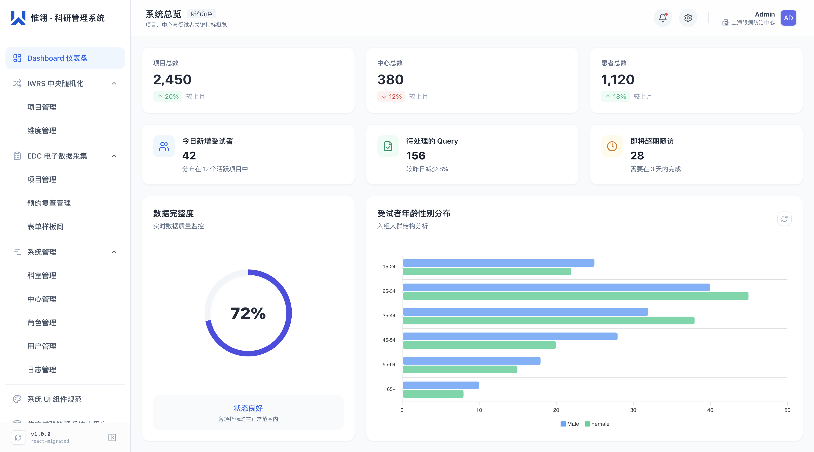
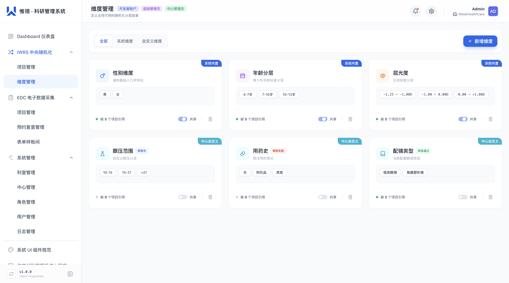
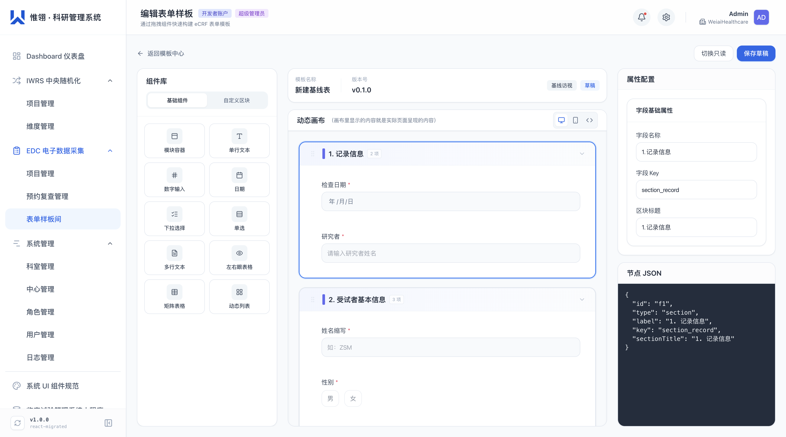

# 惟爱 · 科研管理系统（医疗科研全链路一体化解决方案）

> **面向对象**：医院科室、临床医生、研究机构 / CRO  
> **文档版本**：v1.0  
> **更新日期**：2026 年 9 月

---

## 目录

1. [系统概述与核心价值](#1-系统概述与核心价值)
2. [面向医生的八大核心优势](#2-面向医生的八大核心优势)
3. [IWRS 中央随机化系统](#3-iwrs-中央随机化系统)
4. [EDC 电子数据采集系统](#4-edc-电子数据采集系统)
5. [全链路数据打通与 AI 智能助手](#5-全链路数据打通与-AI-智能助手)
6. [系统化管理与权限控制](#6-系统化管理与权限控制)
7. [适用场景与典型科室](#7-适用场景与典型科室)
8. [典型应用案例](#8-典型应用案例)
9. [技术架构与部署方案](#9-技术架构与部署方案)
10. [总结与展望](#10-总结与展望)

---

## 1. 系统概述与核心价值

### 1.1 我们是谁

**惟爱 · 科研管理系统** 是一套专为中国医疗临床研究场景打造的**全链路一体化科研管理平台**，目前依托于惟爱医疗，主要聚焦于眼科眼视光领域。

我们将临床研究中最核心的两个环节——**中央随机化分组（IWRS）** 与 **电子数据采集（EDC）**——深度打通，并配套多中心管理、科室协作、权限控制、操作审计等完整系统能力，帮助医生和研究团队 **从项目立项到数据导出，全程无断点、无需切换系统**。

### 1.2 传统科研管理的痛点

| 痛点 | 医生/研究者的真实困扰 |
|---|---|
| **系统割裂** | IWRS、EDC、受试者管理分散在 3–5 套系统中，数据反复导入导出，极易出错 |
| **定制昂贵** | 换一个适应症就要找供应商二次开发，排队 2 周 + 报价 10 万起步 + 研发周期 2 个月起步 |
| **随机化不灵活** | 传统 IWRS 只支持简单的"性别+年龄"分层，复杂维度（屈光度、BMI、疾病亚型等）无法满足，每次需求都需要定制化开发 |
| **CRF 表单难用** | 纸制表格容易丢，传统 EDC 填写体验像填报税表，CRC 怨声载道 |
| **执行不可控** | 入组进度全靠微信群问，随访超期没人提醒，数据缺失后补造假风险高 |
| **多中心协作难** | 分中心数据不透明，负责人（组长）单位看不到各中心真实入组速度和数据质量 |

### 1.3 惟爱系统的解决思路

```
┌──────────────────────────────────────────────────────────────────────┐
│                     惟爱 · 科研管理系统(CTMS)一体化架构                      │
├──────────────────────┬───────────────────────┬───────────────────────┤
│   IWRS 中央随机化     │    EDC 电子数据采集    │     系统级管理底座      │
│                      │                       │                       │
│  ✅ 自定义维度分层    │  ✅ 拖拽式 CRF 构建    │  ✅ 多科室/多中心      │
│  ✅ 动态因子匹配      │  ✅ 10+ 专业字段类型   │  ✅ 角色权限控制       │
│  ✅ 二阶段裂变随机    │  ✅ 访视时间轴管理     │  ✅ 全量操作日志       │
│  ✅ 盲态/揭盲管理     │  ✅ 质疑(Query)流程    │  ✅ 数据导出与审计     │
└──────────────────────┴───────────────────────┴───────────────────────┘
                              ↓ 底层数据 100% 打通
              受试者编号 ←→ 随机分组 ←→ 访视数据 ←→ 质疑记录
```

---

## 2. 面向医生的八大核心优势

### ✅ 优势一：一套系统管到底，告别数据来回倒

**再也不需要**：Excel 管理受试者 → 导入 IWRS 随机 → 再导出到 EDC 填数据 → 再导入 SPSS 分析。

惟爱系统中，**受试者从入组那一刻起，ID、分组信息、访视计划、采集表单自动关联**，任何环节的数据变更实时同步，CRC 和研究者只需要面对一个界面。

> 🎯 **医生 / CRC 收益**：减少 80% 跨系统操作时间，避免"编号对不上"这类低级错误，让你的团队把精力放在看病和随访上，而不是做数据搬运工。



---

### ✅ 优势二：IWRS 支持"自定义维度"，任何适应症零开发适配

传统 IWRS 供应商听到"这个项目要按屈光度 + 眼轴长度 + 角膜曲率 3 维度分层"时，第一反应是——"需要评估，报价另算"。

**惟爱 IWRS 不一样**：

- 维度完全可视化配置，年龄、性别、BMI、屈光度、疾病亚型……**你想到什么维度，系统就支持什么维度**
- 维度选项管理员随时维护，**新增/修改维度无需写一行代码**
- 分组支持 **均匀随机（Uniform）** 和 **自由配额（Free）** 双模式
- 因子级配额精确控制：例如"4-7 岁 + 屈光度 -1.0~-0.5D + 女性"这组组合，在实验组中精确分配 12 人

> 🎯 **医生收益**：眼科、骨科、肿瘤、精神科……**不管你的研究设计多复杂，都不用等供应商。** 今天下午立项，今晚就能配好随机化方案，第二天就开始入组。

- 维度页面 



- 新增维度


---

### ✅ 优势三：EDC 表单"样板间"拖拽构建，不会写代码也能做 CRF

传统 EDC 构建一个 eCRF 表单，需要懂技术的人配合：学 Oracle RDC、学 Medidata Rave、找供应商……周期通常 1–3 个月。

**惟爱 EDC 不一样**：

- **可视化拖拽构建**：左侧组件库（文本、数字、日期、单选、矩阵、动态列表、眼网格图…）拖到中间画布，右侧配置属性，所见即所得
- **PC / 移动端双预览**：同一个表单，随时切换"PC 视图 / 手机视图 / Schema 代码"，确保 CRC 在手机上也能流畅填写
- **"样板间"复用机制**：做好的基线表、随访表、不良事件表存为模板，**下一项目直接拖拽对应表单进来，5 分钟搞定 EDC 配置**
- 内置 **Section（分区）** 容器：把"人口学信息""病史""体格检查"归组，支持独立折叠/展开/复制/删除

> 🎯 **医生收益**：**研究团队自己就能做 CRF 设计。** 省掉 1–2 个月的 EDC 搭建周期，项目启动速度快一倍。



---

### ✅ 优势四：全链路数据打通——分组信息自动流入 EDC

这是惟爱系统最独特的能力：**IWRS 完成随机分组后，EDC 里的受试者自动带上分组标签**，同时还支持任意时刻将 IWRS 的分组数据同步到 EDC 系统。

具体来说：

1. CRC 在 IWRS 录入受试者信息 → 系统完成分层匹配 → 生成随机号 + 药物编号
2. 点击"进入访视"，该受试者自动出现在 EDC 项目的受试者列表中
3. EDC 的每个访视表单中，**受试者编号、中心、随机分组等元信息自动填入，无需二次输入**
4. 揭盲时一键切换"盲态 / 非盲态"，EDC 端分组信息同步隐藏或展示

> 🎯 **医生收益**：**杜绝了"随机分组表和 EDC 数据对不上"的致命风险。** 这是 GCP 核查中最容易出问题的环节，也是很多研究团队的噩梦。


---

### ✅ 优势五：访视时间轴 + 预约提醒，随访不再靠脑记

惟爱系统内置 **访视时间轴（Visit Timeline）**：

- 每个受试者的 V0 基线、V1 3M、V2 6M、V3 12M……**自动按研究方案排布**，一眼看出"这人该做哪次访视了"
- 左侧固定栏展示完整时间轴，点击直接跳转到对应访视的 CRF 表单
- 即将超期 / 已超期的访视自动高亮预警
- 预约复查管理模块：把 CRC 需要跟进的人群排成清单，**"本周要联系谁"一目了然**

> 🎯 **医生收益**：**大幅降低脱落率。** 临床研究中 30% 的退出源于"忘了联系受试者"，系统自动提醒把这件事从"靠责任心"变成"靠流程"。


---

### ✅ 优势六：多中心 / 多科室 / 多角色协作全支持

一个系统覆盖 **医院级组织架构**：

- **科室管理**：眼科、心内科、内分泌科……每个科室独立管理自己的研究项目和人员
- **中心管理**：多中心研究中，组长单位可查看各分中心入组速度、数据完整度对比
- **角色权限**：PI（项目负责人）/ 协作医生 / CRC / CRA / 申办方……角色预置，敏感操作（揭盲、删除、导出）精细化授权
- **用户管理**：支持管理员批量创建账号，一键分配项目权限

> 🎯 **医生收益**：**科主任一眼看到全科室所有研究的推进情况。** 不用再挨个找 PI 问"你那个项目进展怎么样了"。


---

### ✅ 优势七：全量操作日志 + 软删除，GCP 审计无忧

临床研究最怕查审计。惟爱系统：

- **日志管理模块**：用户登录、项目创建、受试者入组、分组操作、表单修改、数据导出……**每一步操作留痕**，支持按"时间 / 操作人 / 模块 / 关键词"多维检索
- **日志详情抽屉**：点进去看单次操作的完整上下文（改了什么字段、旧值是什么、新值是什么、IP 地址、浏览器、时间戳）
- **软删除机制**：项目和数据删除不是真删，只是标记隐藏，审计时随时可回溯
- **盲态切换留痕**：谁、在什么时候、以什么身份查看了揭盲信息，永久记录

> 🎯 **医生收益**：**机构伦理审查和 GCP 核查时，打开系统就是全套证据链。** 再也不用翻 3 年前的纸质日志凑材料。


---

### ✅ 优势八（开发中）：WEyeAI 科研助手——你的 7×24 小时数据分析师

每个项目详情页内置 **WEyeAI AI 助手面板**，内置 4 大高频场景模板：

| 快捷动作 | AI 帮你做什么 |
|---|---|
| **📊 项目速览** | 3 句话总结当前进度、重点指标、3 个最值得关注的问题 |
| **📈 入组进度分析** | 对比入组目标 vs 实际节奏，给出下周推进建议 |
| **⚠️ 风险提示** | 自动筛查超期随访、失败样本异常聚集、单一医生来源依赖 |
| **🔍 结构化数据分析** | 按"分析目标 / 筛选规则 / 时间范围 / 异常阈值"模板化输出结论 |

AI 助手会基于 **当前页面的真实数据** 给出分析，不是空泛的聊天。你还可以随时切换底层大模型（WEyeAI / DeepSeek / 千问）。

> 🎯 **医生收益**：**每周组会汇报不用再熬夜做 PPT 了。** 打开 AI 助手→ 点"入组进度"→ 复制结论 → 粘贴到汇报材料，2 分钟搞定。


---

## 3. IWRS 中央随机化系统

### 3.1 什么是 IWRS

IWRS（Interactive Web Response System，交互式网络应答系统）负责临床研究中 **受试者入组时的分层匹配 + 随机分配 + 药物编号派发**，是 RCT（随机对照试验）的核心系统。

### 3.2 惟爱 IWRS 功能清单

| 模块 | 功能说明 |
|---|---|
| **项目创建向导** | 4 步向导式创建：基础信息 → 维度选择 → 分组配置 → （可选）二阶段裂变 |
| **基础信息配置** | 项目编号、名称、负责人、协作医生、CRC、关联中心、纳入/排除标准 |
| **自定义维度** | 维度完全自定义，管理员在"维度管理"模块随时维护新维度和新选项 |
| **分组模式** | 均匀分组（系统自动平均分配）/ 自由分组（手动指定各组配额） |
| **因子级配额** | 各分组内，每个"维度因子组合"的目标人数精确可配 |
| **二阶段裂变（Multi-stage）** | 支持 Stage 1 → Stage 2 二次随机化，适合富集设计、剂量爬坡、交叉试验 |
| **分组/药物管理** | 每组可关联产品/药物名称，药物编号随入组自动派发 |
| **受试者入组抽屉** | 一键录入受试者信息，系统实时计算匹配结果（成功 / 失败 / 待处理） |
| **分组与维度概览** | 每个实验组/对照组实时展示：性别分布、年龄段、指标分布、因子匹配缺口 |
| **盲态管理** | 一键切换盲态 / 非盲态，盲态下分组信息对所有非授权用户隐藏 |
| **项目生命周期** | 初始化 → 未开始 → 进行中 → 已结束，状态流转留痕 |
| **AI 辅助决策** | 项目详情内置 AI，辅助入组进度分析与风险预警 |

### 3.3 关键界面一览

#### 3.3.1 项目管理总览


项目列表支持 **全部 / 进行中 / 已结束** 状态筛选，每条项目展示：

- 项目编号 + 名称 + 裂变标记
- 状态指示器（进行中带呼吸动画效果）
- 入组进度条（已入组 / 目标人数）
- 负责人、创建日期等关键信息

#### 3.3.2 4 步项目创建向导


| 步骤 | 核心操作 |
|---|---|
| **Step 1 基础设置** | 项目基本信息、关联中心、纳排标准 |
| **Step 2 维度选择** | 勾选本研究需要的分层维度，实时预览已选维度的选项组合 |
| **Step 3 分组配置** | 选择分组模式（均匀/自由）、设置总人数、新增/删除分组、配置因子配额 |
| **Step 4 裂变配置（可选）** | 开启二阶段裂变，设置 Stage 2 子组分配规则 |

#### 3.3.3 分组与维度实时概览


每个分组卡片展示：

- 当前入组人数 / 目标人数（大号数字突出）
- 性别分布、年龄段分布、指标分布（如屈光度分层）
- **因子匹配详情**：重点展示每个"维度因子组合"的已入组数 vs 目标数，差额用红色标记，**帮助 CRC 快速理解"还缺哪类病人"**

#### 3.3.4 受试者录入与匹配


填写受试者基本信息后，系统：

1. 自动匹配维度因子组合
2. 检查该组合剩余配额
3. 执行随机分配算法
4. 输出：✅ 入组成功（分配到 X 组 + 药物编号）/ ❌ 匹配失败（原因：某因子配额已满）/ ⏳ 待处理（需人工确认）

---

## 4. EDC 电子数据采集系统

### 4.1 什么是 EDC

EDC（Electronic Data Capture，电子数据采集）用于在临床研究过程中 **电子化记录受试者每次访视的 CRF（Case Report Form，病例报告表）数据**，替代传统的纸制表格。

### 4.2 惟爱 EDC 功能清单

| 模块 | 功能说明 |
|---|---|
| **项目配置** | 未配置 → 筹备中 → 进行中 → 已结束，4 阶段状态流转 |
| **模板中心（样板间）** | 所有可复用的 eCRF 表单模板集中管理，支持按"基线 / 随访期 / 安全性事件"分类 |
| **拖拽式模板构建器** | 左侧组件库 + 中间画布 + 右侧属性面板，三栏式专业构建体验 |
| **专业字段类型** | 文本、数字、日期、单选、下拉、多行文本、分区(Section)、动态列表、矩阵、眼网格图(EyeGrid) |
| **多视图预览** | PC 桌面视图 / 移动端手机视图 / JSON Schema 视图，一键切换 |
| **访视时间轴** | V0 基线 / V1 3M / V2 6M / V3 12M……时间轴可视化，点击跳转对应访视表单 |
| **受试者信息卡** | 左侧固定栏：姓名缩写、筛选号、随机号、来源、中心、入组日期、下次访视日期 |
| **表单目录导航** | 右侧固定目录：分区标题快速定位，大表单无需滚动半天 |
| **只读 / 编辑模式** | 双模式切换：查看时保护数据，编辑时可修改 |
| **质疑(Query)流程** | 发现异常数据时一键"提出质疑"，工作流闭环 |
| **受试者筛选** | 按关键词 / 访视阶段 / 状态多维筛选，筛选中 / 已入组 / 随访中 / 提前退出分类清晰 |
| **数据导出** | 受试者数据一键导出 Excel / CSV |
| **预约复查管理** | 即将到期随访集中展示，CRC 跟进清单式管理 |

### 4.3 关键界面一览

#### 4.3.1 样板间拖拽构建器

这是惟爱 EDC 最有特色的界面：


| 区域 | 作用 |
|---|---|
| **左侧 组件库（320px）** | 10+ 专业字段分类展示，支持"单字段拖拽"和"区块（Block）批量插入"两种模式 |
| **中间 动态画布** | 所见即所得的 CRF 预览，支持 Section 分区折叠、字段复制/删除、PC/手机/代码三视图切换 |
| **右侧 属性面板 + JSON（360px）** | 上半部分：选中字段的标签、必填、选项、校验规则、占位提示配置；下半部分：实时 JSON 预览，高级用户可直接改 JSON |

支持的字段类型：

| 字段类型 | 适用场景 |
|---|---|
| **TextField 文本** | 姓名、病史简述、过敏史 |
| **NumberField 数字** | 年龄、身高、体重、血压值 |
| **DateField 日期** | 出生日期、就诊日期、手术日期 |
| **RadioField 单选** | 性别、吸烟史、是否有合并症 |
| **SelectField 下拉** | 民族、职业、药物名称 |
| **TextareaField 多行** | 体格检查备注、不良事件描述 |
| **SectionField 分区** | 将 CRF 按"人口学 / 病史 / 体格检查 / 实验室检查"分块 |
| **DynamicListField 动态列表** | 既往手术史、用药记录（条数不固定） |
| **MatrixField 矩阵** | 多个症状的 VAS 评分、多组量表条目 |
| **EyeGridField 眼网格图** | 🎯 眼科专用：左右眼的角膜地形图/眼底检查点位标记 |

#### 4.3.2 EDC 项目详情


- 项目头部：状态、申办方、PI、协作医生、CRC、关联中心
- 4 张关键指标卡：筛选中 / 已入组 / 随访中 / 提前退出
- 受试者管理：支持"姓名/筛选号搜索 + 访视阶段筛选 + 状态筛选"三条件组合
- AI 助手侧栏：项目速览 / 数据质量 / 随访提醒 / 数据分析 4 大快捷动作

#### 4.3.3 受试者访视数据采集


经典的 **三栏式受试者工作区**：

| 左栏（292px）信息卡 + 访视轴 | 中栏（自适应）访视表单 | 右栏（224px）分区导航 |
|---|---|---|
| 受试者姓名缩写、筛选号 | 只读 / 编辑模式切换 | Section 分区列表 |
| 随机号、来源、中心、入组日期 | 提出质疑 / 暂存 / 保存 | 点击平滑滚动到对应区块 |
| 下次访视日期 | 动态渲染的 eCRF 表单（10+ 字段类型） | |
| **访视时间轴**（V0→V1→V2→V3） | | |

---

## 5. 全链路数据打通与 AI 智能助手

### 5.1 数据打通的真实含义

```
受试者录入（IWRS）
      ↓  ID 自动关联
  随机分组 + 药物编号派发
      ↓  分组信息实时流入
EDC 受试者自动建档
      ↓  元信息自动填充
 每次访视填写 CRF
      ↓  表单数据结构化存储
 质疑（Query）闭环处理
      ↓  数据完整度实时计算
 一键导出 SPSS / SAS 格式
```

**关键数据点 100% 自动关联，无需人工维护：**

| IWRS 端产生的数据 | EDC 端自动呈现 |
|---|---|
| 受试者编号 / 筛选号 | 所有访视表单顶部自动显示 |
| 随机分组结果 | 受试者信息卡展示（盲态下隐藏）|
| 分层因子（性别/年龄/维度）| 可直接在 EDC 筛选受试者时使用 |
| 入组中心 / 来源医生 | EDC 导出数据时自动带出 |

### 5.2 WEyeAI 科研助手能力矩阵

AI 助手并非简单的聊天框，而是 **深度嵌入每个业务场景的决策辅助**：

| 场景模块 | AI 能力 | 给谁用 |
|---|---|---|
| **IWRS 项目详情** | 项目速览、入组节奏判断、失败样本复盘、来源依赖预警 | PI / 研究护士 |
| **EDC 项目详情** | 数据质量评估、随访超期人群、退出原因聚类、CRC 执行建议 | PI / CRA / CRC |
| **受试者数据填写** | 字段级异常自动识别（如"收缩压 260"自动提示疑似异常）| CRC |
| **随访到期提醒** | 按中心 / 按 CRC 生成每周跟进清单 | 研究护士 |
| **导出数据前** | 数据缺失点扫描 + 异常值检测报告生成 | 统计师 / PI |

### 5.3 内置模型切换

系统预置对接 3 个大模型服务，管理员可按场景选用：

- **WEyeAI（默认推荐）**：基于惟眼医疗自研的科研场景微调模型，对"屈光度""眼轴""BCVA"等专科术语理解最准确
- **DeepSeek**：长文本推理能力强，适合"总结整份病例报告"类任务
- **千问 Qwen**：对中文上下文理解出色，适合与申办方沟通的邮件/报告草稿生成

---

## 6. 系统化管理与权限控制

### 6.1 组织架构：医院 → 科室 → 项目，三级管控

```
医院（顶层）
  ├── 眼科中心
  │     ├── 白内障科（科室）
  │     ├── 视光科（科室）
  │     └── 眼底科（科室）
  ├── 心血管中心
  │     └── 心内科（科室）
  └── 内分泌科（科室）
```

- 每个科室 **独立管理自己的项目、人员和受试者数据**，不同科室之间数据完全隔离
- 但同一个研究者可以被分配到 **多个科室的多个项目** 中，灵活协作

### 6.2 多中心协作

对于多中心 RCT：

- **组长单位 PI**：可看到 **全部中心** 的入组数据、数据完整度、随访超期情况
- **分中心 PI**：只能看到 **本中心** 的数据
- **CRA（临床监查员）**：按被授权的中心查看数据，可发起 Query 质疑
- **申办方（只读）**：查看汇总统计数据，看不到受试者个人信息（脱敏后）

### 6.3 角色权限矩阵（预置 5 种核心角色）

| 功能 / 角色 | 超级管理员 | PI 负责人 | 协作医生 | CRC | 申办方/CRA |
|---|:---:|:---:|:---:|:---:|:---:|
| 创建/删除项目 | ✅ | ✅ | ❌ | ❌ | ❌ |
| 配置 IWRS 分组 | ✅ | ✅ | ❌ | ❌ | ❌ |
| 录入受试者 | ✅ | ✅ | ✅ | ✅ | ❌ |
| 查看分组信息（揭盲） | ✅ | ✅ | 需授权 | 需授权 | ❌ |
| 填写/编辑 CRF | ✅ | ✅ | ✅ | ✅ | ❌ |
| 发起 Query 质疑 | ✅ | ✅ | ✅ | ✅ | ✅ |
| 导出原始数据 | ✅ | ✅ | 需授权 | ❌ | 脱敏后 |
| 系统配置/用户管理 | ✅ | ❌ | ❌ | ❌ | ❌ |
| 查看操作日志 | ✅ | 本项目 | 本项目 | ❌ | ❌ |

### 6.4 全量操作日志审计

**每一条操作记录 6 要素齐全：**

- 🔹 **谁**（用户账号 + 姓名 + 角色）
- 🔹 **什么时候**（精确到秒的时间戳）
- 🔹 **在哪**（IP 地址 + 浏览器 + 操作系统）
- 🔹 **做了什么**（操作类型：创建/修改/删除/导出/揭盲…）
- 🔹 **操作对象**（项目 ID / 受试者 ID / 表单编号）
- 🔹 **改了什么**（字段级 Diff：旧值 → 新值）

支持按"时间范围 + 用户 + 模块 + 关键词"多维检索，检索结果一键导出为 Excel 作为审计材料。

---

## 7. 适用场景与典型科室

### 7.1 适用的研究类型

| 研究类型 | 是否适用 | 惟爱系统重点支持 |
|---|:---:|---|
| **RCT 随机对照试验** | ✅ 最佳 | IWRS 分层随机 + EDC 全程采集 |
| **真实世界研究（RWS）** | ✅ 适用 | EDC 大样本量表单 + 快速录入 |
| **研究者发起研究（IIT）** | ✅ 首选 | 自建维度 + 自建 CRF + 低成本 |
| **队列研究** | ✅ 适用 | 访视时间轴 + 长周期随访提醒 |
| **上市后临床研究（PMS/PMCF）** | ✅ 适用 | 多中心管理 + 数据导出合规 |
| **单组目标值研究** | ✅ 适用 | IWRS 单组分配 + EDC 数据采集 |
| **交叉设计研究** | ✅ 适用 | IWRS 二阶段裂变（Cross-over） |
| **诊断试验研究** | ✅ 适用 | EDC 矩阵/眼网格图等特殊字段 |

### 7.2 重点推荐科室

| 科室 | 为什么适合惟爱系统 |
|---|---|
| **🏥 眼科** | 🎯 眼网格图(EyeGrid)字段、屈光度维度、眼轴/角膜曲率自定义维度 |
| **🏥 骨科** | 多部位影像数据描述的动态列表字段、疼痛 VAS 矩阵评分 |
| **🏥 肿瘤科** | 复杂的预后因子分层（TNM 分期 / 病理亚型 / 基因检测） |
| **🏥 精神科** | 多种量表矩阵字段、多中心大样本量支持 |
| **🏥 心血管/内分泌** | BMI、血压、血糖、糖化血红蛋白自定义维度 + 长周期随访 |
| **🏥 皮肤科/医美** | 多时间点照片描述 + 疗效评分量表矩阵 |
| **🏥 儿科** | 年龄段精细分层维度 + 监护人信息扩展字段 |
| **🏥 中医科** | 中医证型自定义维度 + 症状量表矩阵 |

> 任何科室的任何研究，只要 **需要随机分组 + 需要规范化采集访视数据**，惟爱系统都能 1 天内完成配置并启动入组。

---

## 8. 典型应用案例

### 案例一：某三甲医院眼科 IIT 研究——**0.01%阿托品滴眼液控制儿童近视**

#### 研究设计
- 类型：多中心 RCT
- 样本量：240 例（实验组 120 / 对照组 120）
- 访视：V0 基线 → V1 3M → V2 6M → V3 12M（共 4 次）
- 分层维度：性别 + 年龄段（4-7/8-10/11-14 岁）+ 屈光度分层（-4.00~-2.50 / -2.50~-0.50 D）

#### 上线前的困难
- 之前用 Excel 做随机，每个中心一个文件，组长单位看不到全局
- CRC 用纸质 CRF 记录，1 个月后发现"6M 访视的 BCVA 漏填率 35%"
- 屈光度分层特别细，传统 IWRS 供应商要价 15 万定制费 + 3 周工期

#### 使用惟爱系统后
- **启动时间**：PI 自己花了 1 天配置维度 + 拖拽 CRF 模板，第 2 天就开始入组
- **屈光度分层**：用自定义维度功能，5 分钟搞定，**零额外费用**
- **随访漏填率**：系统自动提醒 CRC，3M 访视数据完整度从 65% 提升到 94%
- **揭盲效率**：最后统计分析时，一键导出"带分组的全量 CRF 数据集"，统计师当天就拿到清洗好的结构化数据

---

### 案例二：某省级综合医院——**科室级科研管理平台**

#### 背景
- 医院拥有 12 个临床科室，每年开展 IIT 项目 50+ 项
- 之前每个项目各自找供应商，全院每年光 IWRS+EDC 软件费超 200 万，数据还不互通

#### 使用惟爱系统后
- **统一平台**：一套系统覆盖 12 个科室，50+ 项目并行运行
- **科室自治**：每个科室自己建项目、建维度、建 CRF 模板，IT 部门零介入
- **院级视角**：科主任一眼看全科室所有项目进展，院领导可看全院科研项目热力图
- **成本节约**：年度软件成本降低 70%+，项目平均启动周期从 45 天缩短到 7 天

---

## 9. 技术架构与部署方案

### 9.1 技术栈（现代化、安全可靠）

| 层级 | 技术选型 | 选型理由 |
|---|---|---|
| **前端框架** | React 19 + TypeScript | 严格类型保障，减少运行时 bug |
| **样式框架** | Tailwind CSS v4 | 企业级管理后台成熟方案 |
| **状态管理** | Zustand | 轻量、高性能、易调试 |
| **路由** | React Router v7 | 支持哈希路由，内网/离线部署友好 |
| **拖拽引擎** | @dnd-kit | EDC 样板间构建的核心支撑 |
| **图表引擎** | ApexCharts | Dashboard 统计图、年龄性别分布图 |
| **图标库** | Lucide React | 统一的线性图标风格，管理后台适配 |
| **构建工具** | Vite 8 | 秒级热更新，开发体验优异 |
| **打包方案** | vite-plugin-singlefile（可选）| 可打包为单 HTML 文件，U盘/光盘分发即可用 |
| **大模型对接** | WEyeAI / DeepSeek / 千问 | 三模型可切换，AI 能力不被单一厂商锁定 |

### 9.2 部署方案（三选一，灵活满足不同医院要求）

| 部署方式 | 适用场景 | 说明 |
|---|---|---|
| **☁️ 惟爱公有云 SaaS** | 中小型医院 / 单中心研究 / 紧急启动项目 | 开通账号即用，无需 IT 投入，数据每日异地备份，符合医疗云安全规范 |
| **🏥 医院私有云本地化** | 三甲医院 / 多中心大项目 / 数据不出院要求 | 部署在医院内网服务器或私有云，数据物理隔离，支持等保三级测评对接 |
| **💻 单机离线版（Single-file）** | 伦理审查临时演示 / 短期小项目 / 外出采集 | 打包单 HTML 文件，双击即可运行在本地浏览器，无需联网、无需安装 |

### 9.3 数据安全与合规

- **加密传输**：全站 HTTPS TLS 1.3 加密
- **加密存储**：敏感字段（身份证、手机号）入库 AES-256 加密
- **访问控制**：密码复杂度策略 + 连续 5 次失败锁定 + 会话超时自动退出
- **备份策略**：每日增量备份 + 每周全量备份 + 异地容灾（公有云模式）
- **合规支持**：支持与医院 HIS / LIS / PACS 系统对接（定制开发）
- **审计追踪**：全量操作日志 + 字段级变更历史，符合 GCP 与 NMPA 核查要求

---

## 10. 总结与展望

### 10.1 一句话总结

> **惟爱 · 科研管理系统 =（可自定义维度的 IWRS 中央随机化）+（拖拽式 EDC 数据采集）+（全链路数据打通）×（AI 智能辅助）**

它不是市面上"又一套 EDC"，而是 **真正站在中国医生日常工作视角设计的、开箱即用的全链路科研平台**。

### 10.2 对医生的价值承诺

- 🔓 **不被供应商绑架**：维度自己配、CRF 自己拖，新研究 1 天内启动
- 💪 **不被执行细节拖垮**：随访自动提醒、数据完整度监控、AI 帮你写周报
- 🧪 **不被 GCP 核查焦虑**：全量日志 + 软删除 + 揭盲留痕，审查随时应战
- 🏥 **不被科室壁垒限制**：多科室多中心一套系统打通，协作顺畅

### 10.3 后续规划

| 阶段 | 重点能力 |
|---|---|
| **2026 Q4** | 受试者端小程序（自己随访填表）、CRA 在线监查、电子签名 eSignature |
| **2027 Q1** | CDISC ODM 标准格式导入导出、与主流统计软件（SPSS/SAS/R）插件对接 |
| **2027 Q2** | 随机抽样 DMP（数据管理计划）模板、SDTM 数据集自动映射 |
| **2027 H2** | 多中心伦理审查协作模块、CTMS 合同财务管理模块 |

---

## 联系我们

如果您对惟爱 · 科研管理系统感兴趣，欢迎联系我们获取 **30 天全功能免费试用**：

| 方式 | 信息 |
|---|---|
| **商务邮箱** | contact@weiai-healthcare.com |
| **产品演示** | 预约线上演示，我们带您完整走通"从新建项目到导出数据"的全流程 |
| **方案定制** | 根据贵院/贵中心的具体研究场景，提供专属配置方案和报价 |

---

> 💡 **文档版本说明**：本文档中所有图片均为系统实际界面截图，可替换为最新版本。如需要 PPT 版本、单页宣传册或定制场景话术，请随时联系我们的产品团队。
